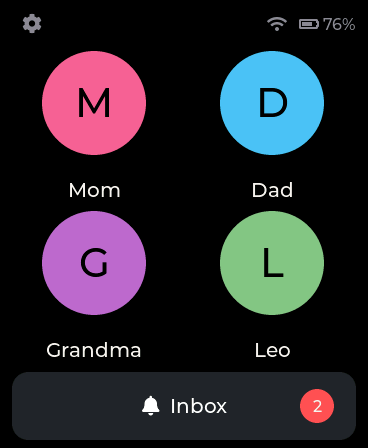
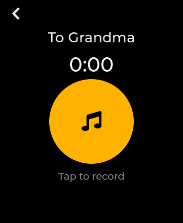
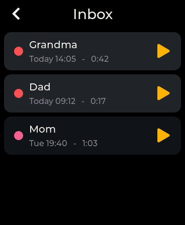
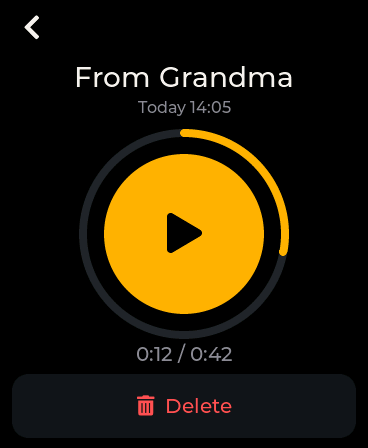
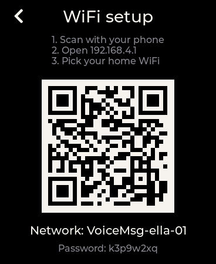

# Pip

**Pip** is a family voice-message device: kids and grandparents exchange short voice
notes on a dedicated gadget — no apps, no accounts on their end, no
strangers. Built on the Waveshare ESP32-S3 Touch AMOLED 1.8" board with a
tiny self-hosted store-and-forward server. Family members without a box
join from their phone through an installable PWA served by the same server.

Open source under the **GNU AGPL-3.0**, with a closed-contribution
policy — see [License and contributions](#license-and-contributions).

<p>





</p>

*(screens from an early build — the shipped UI adds themes, reactions and
presence, but the layout is the same)*

## What it does

- **Voice notes, one tap**: pick a contact, tap to record (up to 90 s),
  review, send or re-record. Physical shortcut buttons: top = record to
  most recent contact, bottom = inbox.
- **Inbox & playback**: unread badges, reply straight from playback,
  local-time timestamps, per-message delete.
- **Reactions & presence**: long-press a message to react with emoji
  (❤️ 👍 👎 😂 …); a live "X is recording to you" indicator shows while a
  message is being made; brand chimes on send/receive.
- **Background themes**: per-user wallpapers with a thumbnail picker on
  both the box and the phone app.
- **Works offline**: messages and contacts persist on-device; the outbox
  drains and the inbox fills whenever WiFi returns.
- **Easy WiFi onboarding**: PIN-protected setup → the box becomes a
  hotspot with a QR code → phone joins → pick the home network in a
  captive portal. Handles hotel captive-portal networks too (the box
  relays the sign-in page to your phone).
- **Phone members**: people without a box use an installable PWA — same
  inbox model, web push notifications (iOS 16.4+), email fallback.
- **Zero-touch updates**: tagged releases are built by GitHub Actions;
  the admin pulls a release with one click (sha256-verified), marks it
  active — and the whole fleet updates over the air within a minute.
  Self-hosters consume the same release manifest (or point
  `PIP_RELEASE_MANIFEST` at their own fork's builds).
- **Family admin**: web admin for users, device provisioning, and an
  n-to-n permissions matrix deciding who can message whom. A box can have
  a *device admin* — a phone user who manages that box's contacts.

## Required hardware

| Role | Hardware |
|---|---|
| Voice box | [Waveshare ESP32-S3-Touch-AMOLED-1.8](https://www.waveshare.com/esp32-s3-touch-amoled-1.8.htm) — 368×448 touch AMOLED, mic + speaker (ES8311 codec), AXP2101 PMU, USB-C. Both board revisions work (V1: SH8601/FT3168; V2: CO5300/CST820). Battery optional: boxes are designed to live on a charger, and the battery UI hides itself when no cell is present. No enclosure required — the bare board is usable as-is. |
| Server | Any small VPS (production runs a €7/mo Hetzner instance on Ubuntu 24.04) plus a domain name for TLS. One `setup.sh` installs everything. |
| Phone users | Nothing — the PWA installs from the browser (Add to Home Screen). |

## How it works

```
[Device A] --record Opus--> HTTPS upload --> [VPS] --MQTT notify--> [Device B]
     ^                                        |  |                     |
     '--- contacts / inbox / OTA <------------'  '-- web push/email--> [Phone PWA]
```

Three components, one version number:

- **Firmware** (`firmware/`): ESP-IDF 5.4 + LVGL 9. Opus audio at 16 kHz
  in a tiny `.vmsg` container, offline-first sync engine, MQTT push,
  OTA. See `firmware/README.md` for the module map.
- **Server** (`server/`): FastAPI + SQLite + Mosquitto behind Caddy on a
  single small VPS. REST API for both client types, audio transcoding for
  browsers, web push + email notify ladder, admin site. See
  `server/README.md` for the module map.
- **PWA** (`server/app/web/`): single-page vanilla JS, service worker for
  push, brand-identical to the firmware UI. Spec in `docs/pwa-spec.md`.

Messages flow **user → user**: each person is either a box user or a
phone user, and the permissions matrix governs people, not hardware.

## Repository layout

| Path | What |
|---|---|
| `firmware/` | ESP-IDF 5.4 project: LVGL 9 UI, audio engine (Opus 16kHz), sync engine, provisioning portal, OTA. `flash_device.sh` flashes firmware + per-device identity in one command. |
| `server/`   | FastAPI + SQLite + Mosquitto + Caddy. REST API for devices and the PWA, the PWA itself (`/app`: vanilla JS, web push, audio transcode), admin website (users, devices + NVS provisioning, permissions matrix, firmware/OTA), retention cleanup. Module map in `server/README.md`. |
| `docs/SELF-HOSTING.md` | Self-host guide (Docker Compose stack at the repo root). |
| `server/SETUP.md` | Production install on a bare VPS (one script). |
| `server/SETUP-LOCAL-MAC.md` | Run the server locally on a Mac first. |
| `docs/` | Rendered UI screens, PWA build spec. |

## Quickstart

1. **Server, locally**: `server/SETUP-LOCAL-MAC.md` — running in ~2 min,
   verified by `smoke_test.py` (~80 end-to-end checks).
2. **Server, production**: `docs/SELF-HOSTING.md` — Docker Compose
   (app + Mosquitto + Caddy) on any small box, or the bare-VPS script
   path in `server/SETUP.md`. Hard requirement either way: a real
   domain with HTTPS.
3. **Firmware**: needs ESP-IDF ≥ 5.4 with component-registry access
   (fetches the Waveshare BSP; libopus builds from the git submodule —
   clone with `--recurse-submodules`).

   ```bash
   cd firmware
   idf.py set-target esp32s3 && idf.py build
   ```
4. **A new device**: PWA → Settings → **"Set up a new Pip"** flashes a
   blank board straight from Chrome/Edge over Web Serial — creates the
   device user, generates its identity, flashes bootloader + firmware —
   then on-device WiFi setup via QR. (Manual alternative: provision in
   the admin → copy the NVS CSV → `./flash_device.sh pip-ella-01.csv`;
   walkthrough in `server/SETUP.md`.)

## Status

**In production for daily family use since August 2026.** A fleet of
boxes plus phone users runs against a Hetzner VPS; firmware updates roll
out over the air. The whole system — boxes, PWA, server —
shares a single version number (`PROJECT_VER` in `firmware/CMakeLists.txt`);
activating a firmware upload refreshes every client. Server endpoints and
admin flows are covered by `server/smoke_test.py`.

## Security model in one paragraph

Devices hold a random per-device bearer token (revocable in the admin);
people sign in with passwordless email codes — a 6-digit single-use code,
stored hashed, granting a sliding-expiry cookie session (PWA and admin
alike). All traffic is TLS (Let's Encrypt via Caddy; same cert serves
MQTT-TLS). Mosquitto uses per-device credentials with ACLs so a device
can only read its own notify topic. The permissions matrix is enforced
server-side on every send, and message audio is only readable by its
recipient. Messages are deleted from the server on delivery (undelivered
ones age out after 30 days) — details in the in-app privacy page.

## License and contributions

Pip is open source under the **GNU AGPL-3.0** (see `LICENSE`): use it,
self-host it for your own family, fork it, change it — but if you make a
modified version available to others, including as a hosted service, you
must release your source under the same terms.

**Open source, closed contributions**: this is a personal project run in
my spare time, and I keep the maintenance surface small. Bug reports and
questions are welcome in the issue tracker; **pull requests are
generally not reviewed or merged** — fork freely instead. Vulnerability
reports go through [SECURITY.md](SECURITY.md), not public issues.
